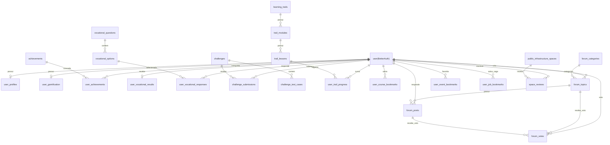

# Modelagem de Dados — ConnectaDev

> **Projeto:** ConnectaDev — Seu Guia para o Futuro em Tecnologia  
> **Escopo:** MVP  
> **SGBD:** PostgreSQL 16+  
> **Autenticação:** Better Auth   
> **Versão do Documento:** 1.0 

---

## 1. Visão Geral e Arquitetura de Dados

O banco de dados do **ConnectaDev** é estruturado sobre o **PostgreSQL**, priorizando integridade referencial.

### 1.1. Integração com Better Auth
O **Better Auth** gerencia o fluxo de autenticação (OAuth, e-mail/senha, tokens). Suas tabelas nativas (`user`, `session`, `account`, `verification`) ficam na estrutura padrão do framework. 
No PostgreSQL, a palavra `user` é reservada, portanto, nas referências SQL utilizamos `"user"`.

* **Estratégia de Vínculo:** As tabelas do ecossistema ConnectaDev (perfis, fórum, progresso) utilizam a coluna `user_id` como **Chave Estrangeira (FK)** apontando diretamente para `"user"(id)` do Better Auth.
* **Extensão de Perfil:** Os dados de negócio específicos do usuário são armazenados na tabela estendida `user_profiles`.

---

## 2. Diagrama de Entidade-Relacionamento (DER - Mermaid)



---

## 3. Estrutura Detalhada das Tabelas

### 3.1. Módulo 0: Perfil & Extensão de Usuário

#### Tabela: `user_profiles`
Armazena informações adicionais do usuário necessárias para a personalização regional e educacional.

| Coluna | Tipo | Nulo | Chave | Default | Descrição |
| :--- | :--- | :--- | :--- | :--- | :--- |
| `user_id` | `TEXT` | Não | PK, FK | - | Referência à tabela `"user"(id)` do Better Auth |
| `bio` | `TEXT` | Sim | - | `NULL` | Biografia do estudante |
| `avatar_url` | `VARCHAR(512)` | Sim | - | `NULL` | Link da foto de perfil |
| `phone_number` | `VARCHAR(20)` | Sim | - | `NULL` | Telefone para contato |
| `education_stage` | `VARCHAR(50)` | Não | - | `'ENSINO_MEDIO_3'` | Estágio atual: `ENSINO_MEDIO_3`, `VESTIBULANDO`, `TRANSICAO_CARREIRA`, `GRADUANDO` |
| `target_institution` | `VARCHAR(100)` | Sim | - | `NULL` | Meta de instituição (ex: `UFPE`, `IFPE`) |
| `target_career` | `VARCHAR(100)` | Sim | - | `NULL` | Carreira de interesse |
| `city` | `VARCHAR(100)` | Não | - | `'Recife'` | Cidade de residência na RMR |
| `neighborhood` | `VARCHAR(100)` | Sim | - | `NULL` | Bairro na RMR |
| `created_at` | `TIMESTAMPTZ` | Não | - | `NOW()` | Data de criação |
| `updated_at` | `TIMESTAMPTZ` | Não | - | `NOW()` | Data da última atualização |

---

### 3.2. Módulo 1: Teste Vocacional & Diagnóstico com IA

#### Tabelas Base: `vocational_questions` e `vocational_options`
Armazenam o questionário e as tags para alimentar a IA.

#### Tabela: `user_vocational_results`
Resultado consolidado do diagnóstico gerado pela IA, simplificado para manter o foco no MVP. As respostas brutas estão em `user_vocational_responses`.

| Coluna | Tipo | Nulo | Chave | Default | Descrição |
| :--- | :--- | :--- | :--- | :--- | :--- |
| `id` | `UUID` | Não | PK | `gen_random_uuid()` | Identificador único |
| `user_id` | `TEXT` | Não | FK, UK | - | Referência a `"user"(id)` |
| `primary_profile` | `VARCHAR(100)` | Não | - | - | Perfil principal recomendado |
| `affinity_tags` | `TEXT[]` | Não | - | - | Array de tags identificadas (ex: `['java', 'spring']`) |
| `ai_summary` | `TEXT` | Não | - | - | Parecer personalizado gerado pela IA |
| `recommended_trail_id` | `UUID` | Sim | FK | `NULL` | Trilha recomendada |
| `created_at` | `TIMESTAMPTZ` | Não | - | `NOW()` | Data do teste |

---

### 3.3. Módulo 2: Desafios de Código

Refinado para garantir que as submissões guardem logs exatos e otimizem consultas de XP.

#### Tabela: `challenges`
| Coluna | Tipo | Nulo | Chave | Default | Descrição |
| :--- | :--- | :--- | :--- | :--- | :--- |
| `id` | `UUID` | Não | PK | `gen_random_uuid()` | Identificador |
| `title` | `VARCHAR(255)` | Não | - | - | Título do desafio |
| `slug` | `VARCHAR(255)` | Não | UK | - | Identificador URL |
| `description` | `TEXT` | Não | - | - | Enunciado (Markdown) |
| `difficulty` | `VARCHAR(20)` | Não | - | `'EASY'` | Dificuldade (`EASY`, `MEDIUM`, `HARD`) |
| `category` | `VARCHAR(50)` | Não | - | - | Categoria |
| `starter_code` | `JSONB` | Não | - | `'{}'` | Templates por linguagem |
| `xp_reward` | `INTEGER` | Não | - | `50` | Recompensa base de XP |

*(As tabelas de submissões e testes acompanham o detalhamento no script SQL final)*

---

### 3.4. Módulo 3 & 4: Trilhas e Cursos (Tech Trails)

As tabelas de trilhas organizam o conteúdo proprietário (`learning_trails`, `trail_modules`, `trail_lessons`), enquanto o módulo de cursos (`courses`) lida com links externos gratuitos (YouTube). O controle de progresso se dá por `user_trail_progress` e `user_course_bookmarks`.

---

### 3.5. Módulo 5: Gamificação (XP, Níveis & Ofensiva Diária)

#### Tabela: `user_gamification`
Mantém o progresso de engajamento diário do usuário.

| Coluna | Tipo | Nulo | Default | Descrição |
| :--- | :--- | :--- | :--- | :--- |
| `user_id` | `TEXT` | PK, FK | - | Referência a `"user"(id)` |
| `total_xp` | `INTEGER` | Não | `0` | Pontuação total |
| `current_level` | `INTEGER` | Não | `1` | Nível atual |
| `current_streak` | `INTEGER` | Não | `0` | Ofensiva diária |
| `longest_streak` | `INTEGER` | Não | `0` | Recorde de dias |

---

### 3.6. Módulo 6: Fórum de Comunidade Tech (RMR)
Focado na troca de conhecimento, estruturado em: `forum_categories` -> `forum_topics` -> `forum_posts`. `forum_votes` gerencia os upvotes e reputação das postagens.

---

### 3.7. Módulos de Feed: Eventos, Vagas e Infraestrutura Pública

Para o MVP, os módulos geográficos (`events`, `public_infrastructure_spaces`) e de scraper (`job_opportunities`) foram consolidados e indexados por latitude/longitude e data de raspagem.

*Novo Adendo:* Tabela `user_job_bookmarks` adicionada para que usuários salvem vagas do cronjob.

---

## 4. Índices de Performance Recomendados

```sql
-- 1. Buscas Geo-Espaciais RMR
CREATE INDEX idx_public_spaces_coords ON public_infrastructure_spaces (latitude, longitude);
CREATE INDEX idx_events_coords ON events (latitude, longitude);

-- 2. Vagas Automáticas (Cronjob)
CREATE UNIQUE INDEX idx_job_opportunities_hash ON job_opportunities (external_id_hash);
CREATE INDEX idx_job_opportunities_active ON job_opportunities (is_active, scraped_at DESC);

-- 3. Fórum e Submissões
CREATE INDEX idx_forum_topics_cat ON forum_topics (category_id, created_at DESC);
CREATE INDEX idx_challenge_sub_user ON challenge_submissions (user_id, challenge_id);
```

---

## 5. Script SQL DDL

Este script pode ser rodado no PostgreSQL para iniciar a base estrutural. (Pressupõe que as tabelas do Better Auth já existam).

```sql
-- Habilitar UUID nativo
CREATE EXTENSION IF NOT EXISTS "uuid-ossp";
CREATE EXTENSION IF NOT EXISTS "pgcrypto";

-- ==============================================================================
-- MÓDULO 0: EXTENSÃO DE USUÁRIO
-- ==============================================================================
CREATE TABLE user_profiles (
    user_id TEXT PRIMARY KEY, -- Referencia a tabela do Better Auth
    bio TEXT,
    avatar_url VARCHAR(512),
    phone_number VARCHAR(20),
    education_stage VARCHAR(50) NOT NULL DEFAULT 'ENSINO_MEDIO_3',
    target_institution VARCHAR(100),
    target_career VARCHAR(100),
    city VARCHAR(100) NOT NULL DEFAULT 'Recife',
    neighborhood VARCHAR(100),
    created_at TIMESTAMPTZ NOT NULL DEFAULT NOW(),
    updated_at TIMESTAMPTZ NOT NULL DEFAULT NOW()
);

-- ==============================================================================
-- MÓDULO 1: VOCACIONAL E IA
-- ==============================================================================
CREATE TABLE vocational_questions (
    id UUID PRIMARY KEY DEFAULT gen_random_uuid(),
    question_text TEXT NOT NULL,
    category VARCHAR(50) NOT NULL,
    order_index INT NOT NULL DEFAULT 0,
    is_active BOOLEAN NOT NULL DEFAULT TRUE
);

CREATE TABLE vocational_options (
    id UUID PRIMARY KEY DEFAULT gen_random_uuid(),
    question_id UUID NOT NULL REFERENCES vocational_questions(id) ON DELETE CASCADE,
    option_text TEXT NOT NULL,
    tag VARCHAR(50) NOT NULL,
    weight INT NOT NULL DEFAULT 1
);

CREATE TABLE user_vocational_responses (
    id UUID PRIMARY KEY DEFAULT gen_random_uuid(),
    user_id TEXT NOT NULL,
    question_id UUID NOT NULL REFERENCES vocational_questions(id) ON DELETE CASCADE,
    selected_option_id UUID NOT NULL REFERENCES vocational_options(id) ON DELETE CASCADE,
    created_at TIMESTAMPTZ NOT NULL DEFAULT NOW()
);

CREATE TABLE user_vocational_results (
    id UUID PRIMARY KEY DEFAULT gen_random_uuid(),
    user_id TEXT NOT NULL UNIQUE,
    primary_profile VARCHAR(100) NOT NULL,
    affinity_tags TEXT[] NOT NULL,
    ai_summary TEXT NOT NULL,
    recommended_trail_id UUID,
    created_at TIMESTAMPTZ NOT NULL DEFAULT NOW()
);

-- ==============================================================================
-- MÓDULO 2: DESAFIOS DE CÓDIGO
-- ==============================================================================
CREATE TABLE challenges (
    id UUID PRIMARY KEY DEFAULT gen_random_uuid(),
    title VARCHAR(255) NOT NULL,
    slug VARCHAR(255) NOT NULL UNIQUE,
    description TEXT NOT NULL,
    difficulty VARCHAR(20) NOT NULL DEFAULT 'EASY',
    category VARCHAR(50) NOT NULL,
    starter_code JSONB NOT NULL DEFAULT '{}'::jsonb,
    xp_reward INTEGER NOT NULL DEFAULT 50,
    created_at TIMESTAMPTZ NOT NULL DEFAULT NOW()
);

CREATE TABLE challenge_test_cases (
    id UUID PRIMARY KEY DEFAULT gen_random_uuid(),
    challenge_id UUID NOT NULL REFERENCES challenges(id) ON DELETE CASCADE,
    input_data TEXT NOT NULL,
    expected_output TEXT NOT NULL,
    is_hidden BOOLEAN NOT NULL DEFAULT FALSE
);

CREATE TABLE challenge_submissions (
    id UUID PRIMARY KEY DEFAULT gen_random_uuid(),
    user_id TEXT NOT NULL,
    challenge_id UUID NOT NULL REFERENCES challenges(id) ON DELETE CASCADE,
    code TEXT NOT NULL,
    language VARCHAR(30) NOT NULL,
    status VARCHAR(30) NOT NULL,
    execution_time_ms INTEGER,
    submitted_at TIMESTAMPTZ NOT NULL DEFAULT NOW()
);

-- ==============================================================================
-- MÓDULO 3 & 4: TRILHAS E CURSOS (Educação)
-- ==============================================================================
CREATE TABLE learning_trails (
    id UUID PRIMARY KEY DEFAULT gen_random_uuid(),
    title VARCHAR(150) NOT NULL,
    slug VARCHAR(150) NOT NULL UNIQUE,
    description TEXT NOT NULL,
    icon_url VARCHAR(512),
    estimated_hours INTEGER NOT NULL DEFAULT 10,
    created_at TIMESTAMPTZ NOT NULL DEFAULT NOW()
);

CREATE TABLE trail_modules (
    id UUID PRIMARY KEY DEFAULT gen_random_uuid(),
    trail_id UUID NOT NULL REFERENCES learning_trails(id) ON DELETE CASCADE,
    title VARCHAR(150) NOT NULL,
    order_index INTEGER NOT NULL DEFAULT 0
);

CREATE TABLE trail_lessons (
    id UUID PRIMARY KEY DEFAULT gen_random_uuid(),
    module_id UUID NOT NULL REFERENCES trail_modules(id) ON DELETE CASCADE,
    title VARCHAR(150) NOT NULL,
    content_type VARCHAR(30) NOT NULL DEFAULT 'TEXT',
    content_body TEXT,
    xp_reward INTEGER NOT NULL DEFAULT 20,
    order_index INTEGER NOT NULL DEFAULT 0
);

CREATE TABLE user_trail_progress (
    id UUID PRIMARY KEY DEFAULT gen_random_uuid(),
    user_id TEXT NOT NULL,
    lesson_id UUID NOT NULL REFERENCES trail_lessons(id) ON DELETE CASCADE,
    completed BOOLEAN NOT NULL DEFAULT FALSE,
    completed_at TIMESTAMPTZ,
    UNIQUE(user_id, lesson_id)
);

CREATE TABLE courses (
    id UUID PRIMARY KEY DEFAULT gen_random_uuid(),
    title VARCHAR(200) NOT NULL,
    provider VARCHAR(100) NOT NULL DEFAULT 'YouTube',
    external_url VARCHAR(512) NOT NULL,
    youtube_playlist_id VARCHAR(100),
    category VARCHAR(50) NOT NULL,
    level VARCHAR(30) NOT NULL DEFAULT 'INICIANTE',
    thumbnail_url VARCHAR(512),
    created_at TIMESTAMPTZ NOT NULL DEFAULT NOW()
);

CREATE TABLE user_course_bookmarks (
    user_id TEXT NOT NULL,
    course_id UUID NOT NULL REFERENCES courses(id) ON DELETE CASCADE,
    status VARCHAR(30) NOT NULL DEFAULT 'SALVO',
    saved_at TIMESTAMPTZ NOT NULL DEFAULT NOW(),
    PRIMARY KEY(user_id, course_id)
);

-- ==============================================================================
-- MÓDULO 5: GAMIFICAÇÃO
-- ==============================================================================
CREATE TABLE user_gamification (
    user_id TEXT PRIMARY KEY,
    total_xp INTEGER NOT NULL DEFAULT 0,
    current_level INTEGER NOT NULL DEFAULT 1,
    current_streak INTEGER NOT NULL DEFAULT 0,
    longest_streak INTEGER NOT NULL DEFAULT 0,
    coins INTEGER NOT NULL DEFAULT 0,
    last_activity_date DATE,
    updated_at TIMESTAMPTZ NOT NULL DEFAULT NOW()
);

CREATE TABLE achievements (
    id UUID PRIMARY KEY DEFAULT gen_random_uuid(),
    code VARCHAR(50) NOT NULL UNIQUE,
    title VARCHAR(100) NOT NULL,
    description TEXT NOT NULL,
    badge_icon_url VARCHAR(512) NOT NULL,
    xp_bonus INTEGER NOT NULL DEFAULT 100
);

CREATE TABLE user_achievements (
    user_id TEXT NOT NULL,
    achievement_id UUID NOT NULL REFERENCES achievements(id) ON DELETE CASCADE,
    unlocked_at TIMESTAMPTZ NOT NULL DEFAULT NOW(),
    PRIMARY KEY(user_id, achievement_id)
);

-- ==============================================================================
-- MÓDULO 6: FÓRUM
-- ==============================================================================
CREATE TABLE forum_categories (
    id UUID PRIMARY KEY DEFAULT gen_random_uuid(),
    name VARCHAR(100) NOT NULL,
    slug VARCHAR(100) NOT NULL UNIQUE,
    description TEXT
);

CREATE TABLE forum_topics (
    id UUID PRIMARY KEY DEFAULT gen_random_uuid(),
    category_id UUID NOT NULL REFERENCES forum_categories(id) ON DELETE CASCADE,
    author_id TEXT NOT NULL,
    title VARCHAR(255) NOT NULL,
    content TEXT NOT NULL,
    upvotes_count INTEGER NOT NULL DEFAULT 0,
    replies_count INTEGER NOT NULL DEFAULT 0,
    created_at TIMESTAMPTZ NOT NULL DEFAULT NOW(),
    updated_at TIMESTAMPTZ NOT NULL DEFAULT NOW()
);

CREATE TABLE forum_posts (
    id UUID PRIMARY KEY DEFAULT gen_random_uuid(),
    topic_id UUID NOT NULL REFERENCES forum_topics(id) ON DELETE CASCADE,
    author_id TEXT NOT NULL,
    content TEXT NOT NULL,
    is_solution BOOLEAN NOT NULL DEFAULT FALSE,
    created_at TIMESTAMPTZ NOT NULL DEFAULT NOW()
);

CREATE TABLE forum_votes (
    id UUID PRIMARY KEY DEFAULT gen_random_uuid(),
    user_id TEXT NOT NULL,
    topic_id UUID REFERENCES forum_topics(id) ON DELETE CASCADE,
    post_id UUID REFERENCES forum_posts(id) ON DELETE CASCADE,
    created_at TIMESTAMPTZ NOT NULL DEFAULT NOW(),
    CHECK (
        (topic_id IS NOT NULL AND post_id IS NULL) OR 
        (topic_id IS NULL AND post_id IS NOT NULL)
    ),
    UNIQUE(user_id, topic_id, post_id)
);

-- ==============================================================================
-- MÓDULO 7: EVENTOS RMR
-- ==============================================================================
CREATE TABLE events (
    id UUID PRIMARY KEY DEFAULT gen_random_uuid(),
    title VARCHAR(200) NOT NULL,
    description TEXT NOT NULL,
    location_name VARCHAR(150) NOT NULL,
    address TEXT NOT NULL,
    latitude DOUBLE PRECISION,
    longitude DOUBLE PRECISION,
    start_date TIMESTAMPTZ NOT NULL,
    end_date TIMESTAMPTZ,
    is_free BOOLEAN NOT NULL DEFAULT TRUE,
    external_link VARCHAR(512) NOT NULL,
    created_at TIMESTAMPTZ NOT NULL DEFAULT NOW()
);

CREATE TABLE user_event_bookmarks (
    user_id TEXT NOT NULL,
    event_id UUID NOT NULL REFERENCES events(id) ON DELETE CASCADE,
    created_at TIMESTAMPTZ NOT NULL DEFAULT NOW(),
    PRIMARY KEY (user_id, event_id)
);

-- ==============================================================================
-- MÓDULO 8: VAGAS DE ESTÁGIO (CRONJOB)
-- ==============================================================================
CREATE TABLE job_opportunities (
    id UUID PRIMARY KEY DEFAULT gen_random_uuid(),
    title VARCHAR(200) NOT NULL,
    company_name VARCHAR(150) NOT NULL,
    description TEXT NOT NULL,
    requirements TEXT,
    location VARCHAR(100) NOT NULL DEFAULT 'Recife / Híbrido',
    contract_type VARCHAR(50) NOT NULL DEFAULT 'ESTAGIO',
    application_link VARCHAR(512) NOT NULL,
    source_name VARCHAR(100) NOT NULL,
    external_id_hash VARCHAR(64) NOT NULL UNIQUE,
    is_active BOOLEAN NOT NULL DEFAULT TRUE,
    scraped_at TIMESTAMPTZ NOT NULL DEFAULT NOW()
);

CREATE TABLE user_job_bookmarks (
    user_id TEXT NOT NULL,
    job_id UUID NOT NULL REFERENCES job_opportunities(id) ON DELETE CASCADE,
    created_at TIMESTAMPTZ NOT NULL DEFAULT NOW(),
    PRIMARY KEY (user_id, job_id)
);

-- ==============================================================================
-- MÓDULO 9: INFRAESTRUTURA PÚBLICA
-- ==============================================================================
CREATE TABLE public_infrastructure_spaces (
    id UUID PRIMARY KEY DEFAULT gen_random_uuid(),
    name VARCHAR(150) NOT NULL,
    space_type VARCHAR(50) NOT NULL,
    address TEXT NOT NULL,
    neighborhood VARCHAR(100) NOT NULL,
    city VARCHAR(100) NOT NULL DEFAULT 'Recife',
    latitude DOUBLE PRECISION NOT NULL,
    longitude DOUBLE PRECISION NOT NULL,
    has_free_wifi BOOLEAN NOT NULL DEFAULT TRUE,
    has_computers BOOLEAN NOT NULL DEFAULT FALSE,
    opening_hours VARCHAR(150)
);

CREATE TABLE space_reviews (
    id UUID PRIMARY KEY DEFAULT gen_random_uuid(),
    space_id UUID NOT NULL REFERENCES public_infrastructure_spaces(id) ON DELETE CASCADE,
    user_id TEXT NOT NULL,
    rating INTEGER NOT NULL CHECK (rating >= 1 AND rating <= 5),
    comment TEXT,
    created_at TIMESTAMPTZ NOT NULL DEFAULT NOW()
);
```
