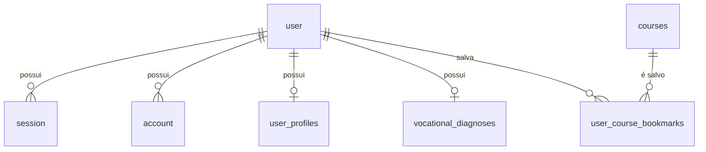

# Modelagem de Dados — ConnectaDev

> **Projeto:** ConnectaDev — Seu Guia para o Futuro em Tecnologia  
> **Escopo:** Modelos atualmente definidos no Prisma
> **SGBD:** PostgreSQL
> **ORM:** Prisma 7
> **Autenticação:** Better Auth
> **Versão do Documento:** 2.0

---

## 1. Visão Geral

O schema vigente está em `backend/prisma/schema.prisma`. O banco utiliza
PostgreSQL e o Prisma mantém os nomes dos modelos em `PascalCase`, enquanto as
tabelas de negócio usam nomes explícitos em `snake_case` por meio de `@@map`.

As tabelas nativas de autenticação são gerenciadas pelo Better Auth:

- `user`
- `session`
- `account`
- `verification`
- `jwks`

As tabelas de negócio atualmente implementadas são:

- `user_profiles`
- `quiz_questions`
- `vocational_diagnoses`
- `courses`
- `user_course_bookmarks`

Não fazem parte do schema atual tabelas de trilhas, desafios, fórum,
gamificação, eventos, vagas ou infraestrutura pública.

---

## 2. Diagrama de Entidade-Relacionamento



`quiz_questions`, `verification` e `jwks` são tabelas independentes no schema
atual. O diagnóstico é associado ao usuário por uma relação 1:1, e os favoritos
formam uma relação N:N entre `user` e `courses`, materializada por
`user_course_bookmarks`.

---

## 3. Convenções e Regras

- Identificadores de negócio com `@default(uuid())` usam UUIDs gerados pelo
  Prisma.
- Identificadores do Better Auth (`user.id`, `session.id`, `account.id`,
  `verification.id` e `jwks.id`) não possuem default no schema e são fornecidos
  pelo framework.
- Campos Prisma `DateTime` representam datas e horários persistidos pelo
  PostgreSQL.
- Campos `Json` armazenam objetos ou arrays JSON.
- Relações com `onDelete: Cascade` removem os registros dependentes quando o
  registro pai é excluído.
- O Prisma não declara enums para `type`, `educationStage` ou `level`; esses
  valores são armazenados como `String`.

---

## 4. Tabelas do Better Auth

### 4.1. Tabela: `user`

Tabela principal de usuários autenticados. No PostgreSQL, o nome físico é
`user`, definido por `@@map("user")`.

| Coluna | Tipo Prisma | Nulo | Chave/Regra | Default | Descrição |
| :--- | :--- | :--- | :--- | :--- | :--- |
| `id` | `String` | Não | PK | - | Identificador do usuário |
| `name` | `String` | Não | - | - | Nome exibido |
| `email` | `String` | Não | - | - | E-mail de autenticação |
| `emailVerified` | `Boolean` | Não | - | - | Indica se o e-mail foi verificado |
| `image` | `String` | Sim | - | `NULL` | URL da imagem do usuário |
| `createdAt` | `DateTime` | Não | - | - | Data de criação |
| `updatedAt` | `DateTime` | Não | - | - | Data da última atualização |

Relações:

- `sessions`: relação 1:N com `session`.
- `accounts`: relação 1:N com `account`.
- `profile`: relação 1:1 opcional com `user_profiles`.
- `diagnosis`: relação 1:1 opcional com `vocational_diagnoses`.
- `courseBookmarks`: relação 1:N com `user_course_bookmarks`.

### 4.2. Tabela: `session`

Armazena as sessões de autenticação ativas ou históricas.

| Coluna | Tipo Prisma | Nulo | Chave/Regra | Default | Descrição |
| :--- | :--- | :--- | :--- | :--- | :--- |
| `id` | `String` | Não | PK | - | Identificador da sessão |
| `expiresAt` | `DateTime` | Não | - | - | Data de expiração |
| `token` | `String` | Não | UNIQUE | - | Token da sessão |
| `createdAt` | `DateTime` | Não | - | - | Data de criação |
| `updatedAt` | `DateTime` | Não | - | - | Data da última atualização |
| `ipAddress` | `String` | Sim | - | `NULL` | Endereço IP da sessão |
| `userAgent` | `String` | Sim | - | `NULL` | Identificação do cliente |
| `userId` | `String` | Não | FK → `user.id` | - | Usuário da sessão |

A FK para `user` usa `onDelete: Cascade`. O schema declara
`@@unique([token])`.

### 4.3. Tabela: `account`

Armazena contas e credenciais associadas a um usuário, incluindo provedores
externos e credenciais de senha.

| Coluna | Tipo Prisma | Nulo | Chave/Regra | Default | Descrição |
| :--- | :--- | :--- | :--- | :--- | :--- |
| `id` | `String` | Não | PK | - | Identificador da conta |
| `accountId` | `String` | Não | - | - | Identificador no provedor |
| `providerId` | `String` | Não | - | - | Identificador do provedor |
| `userId` | `String` | Não | FK → `user.id` | - | Usuário proprietário |
| `accessToken` | `String` | Sim | - | `NULL` | Token de acesso |
| `refreshToken` | `String` | Sim | - | `NULL` | Token de renovação |
| `idToken` | `String` | Sim | - | `NULL` | Token de identidade |
| `accessTokenExpiresAt` | `DateTime` | Sim | - | `NULL` | Expiração do token de acesso |
| `refreshTokenExpiresAt` | `DateTime` | Sim | - | `NULL` | Expiração do refresh token |
| `scope` | `String` | Sim | - | `NULL` | Escopos concedidos |
| `password` | `String` | Sim | - | `NULL` | Credencial de senha armazenada pelo Auth |
| `createdAt` | `DateTime` | Não | - | - | Data de criação |
| `updatedAt` | `DateTime` | Não | - | - | Data da última atualização |
| `issuer` | `String` | Não | - | - | Emissor da conta |

A FK para `user` usa `onDelete: Cascade`.

### 4.4. Tabela: `verification`

Armazena valores temporários usados nos fluxos de verificação do Better Auth.

| Coluna | Tipo Prisma | Nulo | Chave/Regra | Default | Descrição |
| :--- | :--- | :--- | :--- | :--- | :--- |
| `id` | `String` | Não | PK | - | Identificador |
| `identifier` | `String` | Não | - | - | Identificador do fluxo |
| `value` | `String` | Não | - | - | Valor de verificação |
| `expiresAt` | `DateTime` | Não | - | - | Expiração |
| `createdAt` | `DateTime` | Sim | - | `NULL` | Data de criação |
| `updatedAt` | `DateTime` | Sim | - | `NULL` | Data da última atualização |

### 4.5. Tabela: `jwks`

Armazena as chaves usadas pelo Better Auth para operações relacionadas a JWT.

| Coluna | Tipo Prisma | Nulo | Chave/Regra | Default | Descrição |
| :--- | :--- | :--- | :--- | :--- | :--- |
| `id` | `String` | Não | PK | - | Identificador da chave |
| `publicKey` | `String` | Não | - | - | Chave pública |
| `privateKey` | `String` | Não | - | - | Chave privada |
| `createdAt` | `DateTime` | Não | - | - | Data de criação |
| `expiresAt` | `DateTime` | Sim | - | `NULL` | Expiração da chave |
| `alg` | `String` | Sim | - | `NULL` | Algoritmo criptográfico |
| `crv` | `String` | Sim | - | `NULL` | Curva criptográfica |

---

## 5. Tabelas de Perfil e Quiz Vocacional

### 5.1. Tabela: `user_profiles`

Extensão de negócio do usuário autenticado. O campo `userId` é simultaneamente
PK e FK, garantindo no máximo um perfil por usuário. O nome físico é
`user_profiles`; campos com nomes compostos usam `@map`.

| Coluna | Tipo Prisma | Nulo | Chave/Regra | Default | Descrição |
| :--- | :--- | :--- | :--- | :--- | :--- |
| `user_id` | `String` | Não | PK, FK → `user.id` | - | Usuário do perfil |
| `bio` | `String` | Sim | - | `NULL` | Biografia |
| `avatar_url` | `String` | Sim | - | `NULL` | URL do avatar |
| `phone_number` | `String` | Sim | - | `NULL` | Telefone |
| `education_stage` | `String` | Não | - | `ENSINO_MEDIO_3` | Etapa educacional |
| `target_institution` | `String` | Sim | - | `NULL` | Instituição desejada |
| `target_career` | `String` | Sim | - | `NULL` | Carreira desejada |
| `city` | `String` | Não | - | `Recife` | Cidade |
| `neighborhood` | `String` | Sim | - | `NULL` | Bairro |
| `created_at` | `DateTime` | Não | - | `now()` | Data de criação |
| `updated_at` | `DateTime` | Não | - | `now()`/`@updatedAt` | Última atualização |

A relação com `user` usa `onDelete: Cascade`.

### 5.2. Tabela: `quiz_questions`

Catálogo de perguntas do Quiz Vocacional. Apenas registros com `is_active =
true` são consultados pelo endpoint de perguntas.

| Coluna | Tipo Prisma | Nulo | Chave/Regra | Default | Descrição |
| :--- | :--- | :--- | :--- | :--- | :--- |
| `id` | `String` | Não | PK | `uuid()` | Identificador |
| `statement` | `String` | Não | - | - | Texto da pergunta |
| `type` | `String` | Não | - | - | Tipo, como `MULTIPLE_CHOICE` ou `OPEN_TEXT` |
| `sequence` | `Int` | Não | - | - | Ordem de exibição |
| `is_active` | `Boolean` | Não | - | `true` | Ativação da pergunta |
| `options` | `Json` | Sim | - | `NULL` | Opções de múltipla escolha |
| `validation` | `Json` | Sim | - | `NULL` | Regras de validação de texto |
| `created_at` | `DateTime` | Não | - | `now()` | Data de criação |
| `updated_at` | `DateTime` | Não | - | `@updatedAt` | Última atualização |

O schema declara o índice composto `@@index([isActive, sequence])`.

### 5.3. Tabela: `vocational_diagnoses`

Resultado consolidado do Quiz Vocacional para um usuário. A unicidade de
`user_id` implementa a relação 1:1 e permite atualização do diagnóstico por
`upsert`.

| Coluna | Tipo Prisma | Nulo | Chave/Regra | Default | Descrição |
| :--- | :--- | :--- | :--- | :--- | :--- |
| `id` | `String` | Não | PK | `uuid()` | Identificador |
| `user_id` | `String` | Não | UNIQUE, FK → `user.id` | - | Usuário avaliado |
| `area_principal` | `String` | Não | - | - | Área principal recomendada |
| `tecnologias_sugeridas` | `Json` | Não | - | - | Tecnologias ou tags sugeridas |
| `created_at` | `DateTime` | Não | - | `now()` | Data do diagnóstico |
| `updated_at` | `DateTime` | Não | - | `@updatedAt` | Última atualização |

A relação com `user` usa `onDelete: Cascade`.

---

## 6. Tabelas de Cursos e Favoritos

### 6.1. Tabela: `courses`

Catálogo de cursos externos recomendados, atualmente consumidos pela
`CoursesScreen`. Os campos `tags` e `areas` são JSON para permitir múltiplas
classificações sem tabelas auxiliares.

| Coluna | Tipo Prisma | Nulo | Chave/Regra | Default | Descrição |
| :--- | :--- | :--- | :--- | :--- | :--- |
| `id` | `String` | Não | PK | `uuid()` | Identificador |
| `thumbnail` | `String` | Não | - | - | URL da imagem do curso |
| `title` | `String` | Não | - | - | Título |
| `provider` | `String` | Não | - | - | Provedor, como YouTube |
| `level` | `String` | Não | - | - | Nível do curso |
| `external_url` | `String` | Não | - | - | URL externa do conteúdo |
| `tags` | `Json` | Não | - | - | Tags de tecnologia |
| `areas` | `Json` | Não | - | - | Áreas relacionadas |
| `is_active` | `Boolean` | Não | - | `true` | Indica se pode ser recomendado |
| `created_at` | `DateTime` | Não | - | `now()` | Data de criação |
| `updated_at` | `DateTime` | Não | - | `@updatedAt` | Última atualização |

O schema declara `@@index([isActive])`. A API filtra cursos por
`is_active = true` e calcula a relevância com base no diagnóstico do usuário.

### 6.2. Tabela: `user_course_bookmarks`

Relaciona usuários autenticados aos cursos salvos. O campo `id` é a PK técnica,
e `user_id` com `course_id` formam uma combinação única para impedir favoritos
duplicados.

| Coluna | Tipo Prisma | Nulo | Chave/Regra | Default | Descrição |
| :--- | :--- | :--- | :--- | :--- | :--- |
| `id` | `String` | Não | PK | `uuid()` | Identificador do favorito |
| `user_id` | `String` | Não | FK → `user.id` | - | Usuário que salvou |
| `course_id` | `String` | Não | FK → `courses.id` | - | Curso salvo |
| `created_at` | `DateTime` | Não | - | `now()` | Data em que foi salvo |

Restrições e índices:

- `@@unique([userId, courseId])`: uma associação por usuário e curso.
- `@@index([userId])`: acelera a consulta dos favoritos do usuário.
- As FKs para `user` e `courses` usam `onDelete: Cascade`.

---

## 7. Fluxos de Dados Implementados

### 7.1. Consulta do quiz

1. O usuário autenticado solicita as perguntas.
2. `quiz_questions` é filtrada por `is_active = true`.
3. O resultado é ordenado por `sequence ASC`.
4. Se não houver registros ativos, a API retorna `[]` com HTTP 200.

### 7.2. Persistência do diagnóstico

1. O usuário envia as respostas do quiz.
2. O backend calcula o diagnóstico.
3. `vocational_diagnoses` é criado ou atualizado para o `user_id`.
4. A unicidade de `user_id` mantém somente um diagnóstico atual por usuário.

### 7.3. Recomendação de cursos

1. A API consulta o diagnóstico do usuário.
2. Sem diagnóstico, retorna `hasDiagnosis: false` e uma lista vazia.
3. Com diagnóstico, consulta somente cursos ativos.
4. A ordenação prioriza a correspondência de `areas` e `tags`.
5. A resposta expõe `external_url` para abrir o conteúdo do provedor.

### 7.4. Salvamento de favoritos

1. O usuário autenticado envia `POST /api/courses/:courseId/bookmark`.
2. O backend valida a existência do curso.
3. `user_course_bookmarks` é criado com `upsert`.
4. Repetir a operação para a mesma combinação não cria duplicata.

---

## 8. Fonte de Verdade e Atualização

Esta documentação deve ser atualizada junto com
`backend/prisma/schema.prisma`. Para aplicar alterações do schema ao banco de
desenvolvimento, use:

```bash
cd backend
npx prisma db push
npx prisma generate
```

A documentação não lista tabelas que ainda não possuem um `model` no schema
Prisma vigente.
